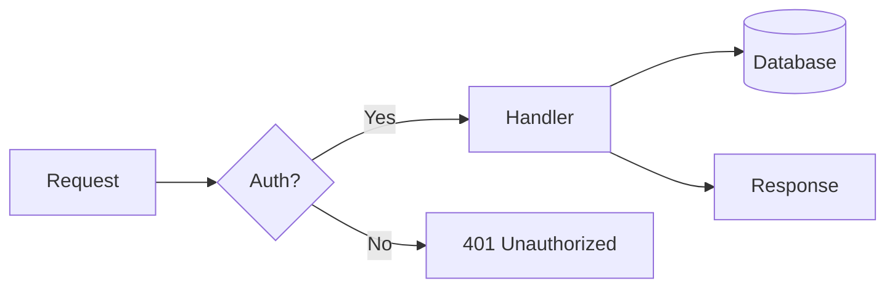

# Slidev Theme Starter

Presentation slides for developers

<div class="pt-12">
  <span @click="$slidev.nav.next" class="px-2 py-1 rounded cursor-pointer" flex="~ justify-center items-center gap-2" hover="bg-white bg-opacity-10">
    Press Space for next page <div class="i-carbon:arrow-right inline-block"/>
  </span>
</div>

---

# What is Slidev?

Slidev is a slide maker and presentation tool designed for developers. It includes the following features:

- 📝 **Text-based** - focus on your content with Markdown, then style it later
- 🎨 **Themable** - themes can be shared and reused as npm packages
- 🧑‍💻 **Developer Friendly** - code highlighting, live coding with autocompletion
- 🤹 **Interactive** - embed Vue components to enhance your expressions
- 🎥 **Recording** - built-in recording and camera view
- 📤 **Portable** - export to PDF, PPTX, PNGs, or even a hostable SPA
- 🛠 **Hackable** - virtually anything that's possible on a webpage is possible in Slidev

<br>
<br>

Read more about [Why Slidev?](https://sli.dev/guide/why)

---

# Navigation

Hover on the bottom-left corner to see the navigation's controls panel

## Keyboard Shortcuts

|     |     |
| --- | --- |
| <kbd>space</kbd> / <kbd>tab</kbd> / <kbd>right</kbd> | next animation or slide |
| <kbd>left</kbd>  / <kbd>shift</kbd><kbd>space</kbd> | previous animation or slide |
| <kbd>up</kbd> | previous slide |
| <kbd>down</kbd> | next slide |

---
layout: image-right
image: https://cover.sli.dev
---

# Code

Use code snippets and get the highlighting directly!

```ts
interface User {
  id: number
  firstName: string
  lastName: string
  role: string
}

function updateUser(id: number, update: Partial<User>) {
  const user = getUser(id)
  const newUser = { ...user, ...update }
  saveUser(id, newUser)
}
```

---
layout: center
class: "text-center"
---

# Learn More

[Documentation](https://sli.dev) / [GitHub Repo](https://github.com/slidevjs/slidev)

---
layout: default
class: nll-light
---

# Light Mode Slide

This slide uses `class: nll-light` in its frontmatter to override to Catppuccin Latte,
regardless of the global dark/light setting.

- Works independently of the `d` key toggle
- Other slides remain in dark mode (Catppuccin Mocha)
- **Bold**, _italic_, and `inline code` all adapt

```ts
// Code blocks also pick up the light theme
function greet(name: string): string {
  return `Hello, ${name}!`
}
```

---
layout: panels-highlight
images:
  - /mock-1.svg
  - /mock-2.svg
  - /mock-3.svg
offsets:
  - '50% 30%'
  - '50% 50%'
  - '50% 20%'
highlighted: 2
---

---

# Mermaid Diagrams



