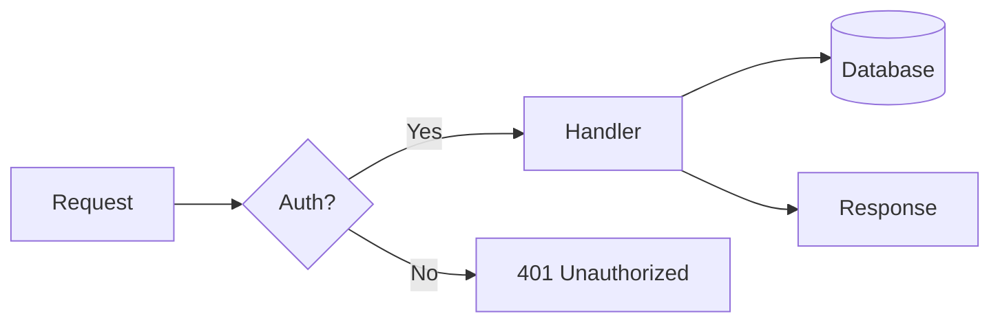

# My Personal Slidev Theme

A Catppuccin-flavoured Slidev theme

---

# Default Slide

The **default** layout with all the trimmings.

- List items get a blue marker
- **Bold** text picks up the accent color
- _Italic_ text is softened to subtext
- `inline code` uses the peach color on a surface background

| Column A | Column B | Column C |
| -------- | -------- | -------- |
| Alpha    | Beta     | Gamma    |
| Delta    | Epsilon  | Zeta     |

---

# Code Highlighting

```ts
interface User {
  id: number
  name: string
  role: 'admin' | 'viewer'
}

function updateUser(id: number, update: Partial<User>): User {
  const user = getUser(id)
  return { ...user, ...update }
}
```

---

# Mermaid Diagrams



---
layout: default
class: nll-light
---

# Per-slide Light Mode

Add `class: nll-light` in a slide's frontmatter to switch to Catppuccin Latte
on that slide only, regardless of the global dark/light toggle.

- Works independently of the `d` key toggle
- **Bold**, _italic_, and `inline code` all adapt

```ts
// Code blocks also pick up the light theme
function greet(name: string): string {
  return `Hello, ${name}!`
}
```

---
layout: section
---

# A New Section

---
layout: statement
---

# This is a bold statement that stands on its own.

---
layout: fact
---

# 42%

Of all statistics are made up on the spot

---
layout: quote
---

> The best way to predict the future is to invent it.

Alan Kay

---
layout: panels-highlight
images:
  - /mock-1.svg
  - /mock-2.svg
  - /mock-3.svg
offsets:
  - '50% 30%'
  - '50% 50%'
  - '50% 20%'
highlighted: 2
---

---
layout: image-left
image: /mock-1.svg
imagePosition: '50% 30%'
---

## Image Left

Content sits in the right two-thirds of the slide, separated from the image by a slanted accent line.

---
layout: image-right
image: /mock-2.svg
imagePosition: '50% 50%'
---

## Image Right

Content sits in the left two-thirds of the slide, separated from the image by a slanted accent line.
